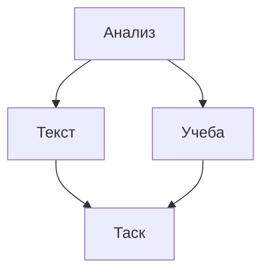

# План обучения
## Изучение азов разметки Markdown
- [x] Заголовки 
- [ ] Флажки
  - [x] Поставить флажок
  - [~] Флажок без возможности редактирования
  - [ ] Неотмеченный флажок
- [x] Списки
- [x] Таблица



```mermaid
graph TD; 
  Анализ задачи-->Написание документа;
  Написание документа-->Резенцирование;
  Резенцирование-->Проверка фактов;
  Проверка фактов-->Публикация
```
